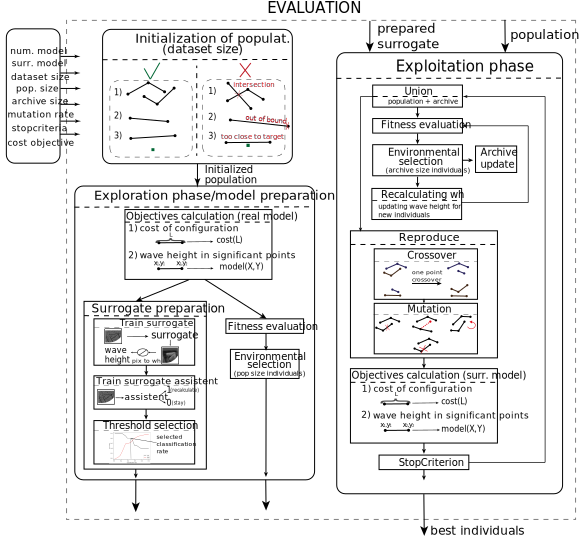

## **Generative design of breakwaters usign deep convolutional neural network as a surrogate model**

This repository contains the code for the paper "Generative design of breakwaters usign deep convolutional neural network as a surrogate model".

Proposed approach has the following form

You can check <em>simple_intro</em> jupyter notebook for simple and fast computable introduction. <em>Swan</em> folder contains the real numerical model, <em>results</em> contains experimental results obtained after running <em>main</em> file. In <em>models</em> folder you can find surrogate models.

